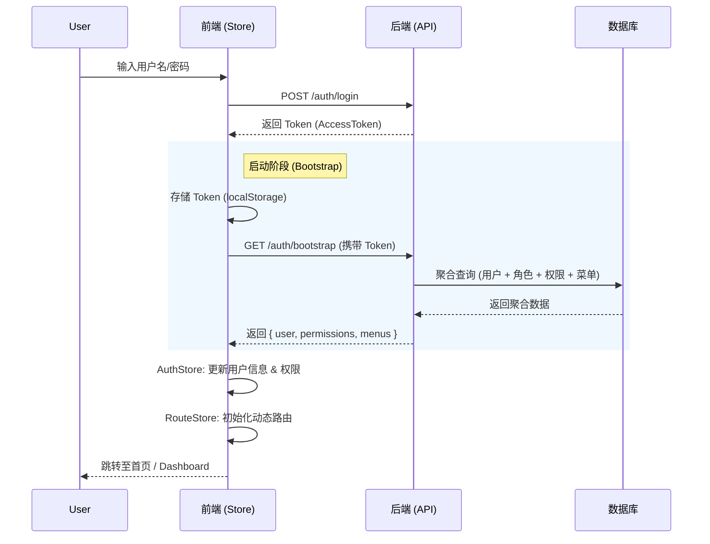

# 前后端联调指南

本指南详细说明了 NestBase 项目中前端（Frontend）与后端（Backend）的交互机制，特别是核心的 **认证与启动（Auth & Bootstrap）** 流程。

## 核心交互流程

### 1. 登录与启动 (Login & Bootstrap)

为了提升用户体验并减少网络请求，我们在 v1.5.0 中引入了 **聚合启动接口 (`/auth/bootstrap`)**。

#### 流程图



#### 关键接口

##### 1.1 登录接口

- **URL**: `POST /api/auth/login`
- **作用**: 验证凭据，获取 JWT Token。
- **响应**: `{ token: { accessToken, refreshToken, expiresIn } }`

##### 1.2 启动接口 (Bootstrap)

- **URL**: `GET /api/auth/bootstrap`
- **作用**: 一次性获取应用初始化所需的所有数据。
- **响应结构**:

```json
{
  "code": "0000",
  "data": {
    "user": { ... },        // 用户基本信息 (含 roles)
    "permissions": [...],   // 权限代码列表 (如 "user.create")
    "menus": {              // 菜单与路由信息
      "routes": [...],      // 动态路由树
      "home": "root"        // 默认首页路由名称
    }
  }
}
```

### 2. 状态管理同步

前端使用 **Pinia** 进行状态管理，主要涉及以下两个 Store 的协同：

#### Auth Store (`apps/frontend/src/store/modules/auth`)

- **职责**: 管理用户身份、Token、权限列表。
- **核心动作**: `initUserInfo()`
  - 调用 `/auth/bootstrap`。
  - 将 `user` 和 `permissions` 存入 state。
  - 将 `menus` 数据传递给 **Route Store**。

#### Route Store (`apps/frontend/src/store/modules/route`)

- **职责**: 管理路由表、侧边栏菜单、面包屑。
- **核心动作**: `initAuthRoute(menus)`
  - 接收从 `Auth Store` 传递来的 `menus` 数据。
  - **不再** 单独调用 `/user/routes` 接口（优化点）。
  - 根据 `menus.routes` 生成 Vue Router 路由表并动态添加。

## 开发注意事项

### 1. 请求超时设置

由于后端服务器（Supabase）位于境外，物理延迟较高，前端请求超时时间已调整为 **30秒**。

- 配置文件: `apps/frontend/src/service/request/index.ts`

### 2. 路由守卫优化

- **避免重复请求**: `onRouteSwitchWhenLoggedIn` 钩子中已移除 `initUserInfo()` 调用，防止每次点击菜单都触发生效。数据仅在**登录时**和**页面刷新时**同步。

### 3. 类型定义

前端 API 类型定义位于 `apps/frontend/src/typings/api.d.ts`。修改后端 DTO 后，请务必同步更新前端类型。

```typescript
// apps/frontend/src/typings/api.d.ts
declare namespace Api {
  namespace Auth {
    interface BootstrapData {
      user: User;
      permissions: string[];
      menus: {
        routes: ElegantConstRoute[];
        home: LastLevelRouteKey;
      };
    }
  }
}
```
